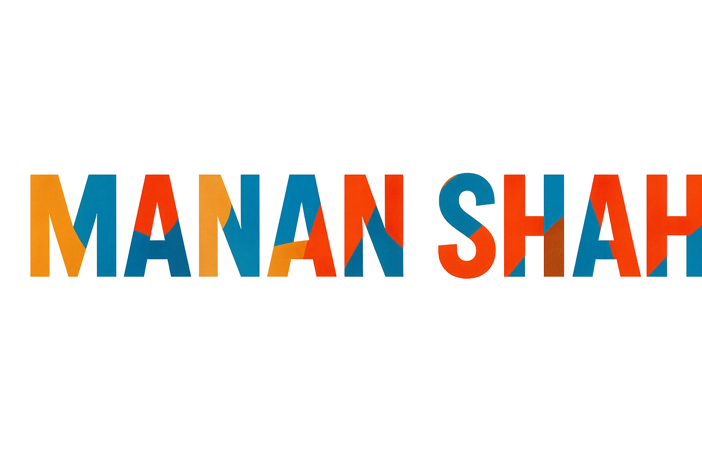

 ### Profile Views : 
  

### How to reach me: <strong>(Click the badge to view my profiles.)</strong>

    

### Here are some ideas to help you get started:

- 🎓 Graduate Student in <strong>Computer Science<strong> at Illinois Institute of Technology in Chicago
- 🔭 Exploring <strong>Full‑Stack Web Development and open‑source contributions<strong>
- 🌱 Learning cloud‑native architecture and DevOps practices
- 🔍 Seeking collaboration on <strong>AI‑powered web applications<strong> and serverless solutions
- 💬 Ask me about Java, Python, ASP.​NET, AWS, Azure, data structures, and system design
- ⚡ Fun fact: I once reverse‑engineered a vintage arcade machine to run custom games.

### Tools I work upon : 🛠

                        

